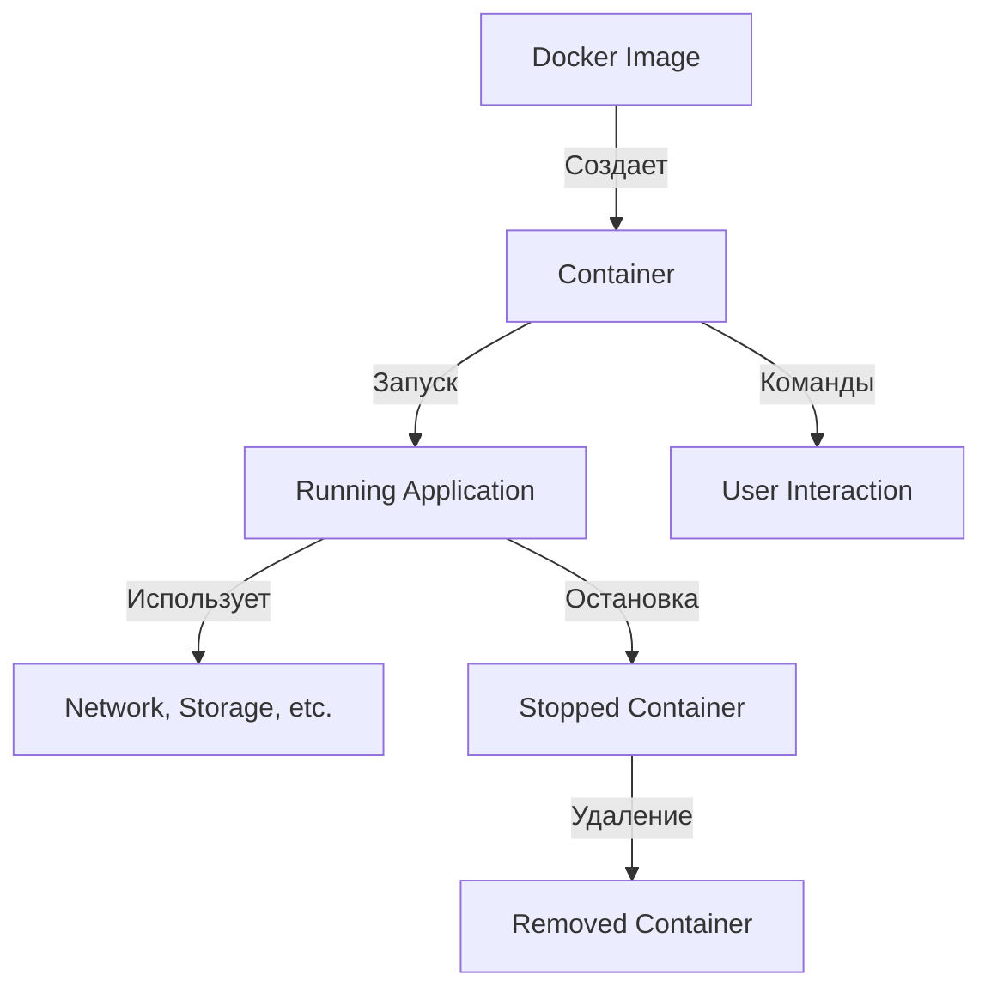

---
tags:
  - Docker
---
# Как Работают Контейнеры

Контейнеры — это одна из ключевых технологий виртуализации, используемая для упаковки приложений и их зависимости таким образом, чтобы они могли быть развернуты и выполнены в любом окружении. Основные принципы работы контейнеров включают изоляцию, лёгкость и быстроту.

![[Pasted image 20250318102301.png]]
## Основные Принципы Работы Контейнеров

### 1. Изоляция

- **Изолированная Среда**: Контейнеры создают изолированную среду для приложений. Каждый контейнер содержит все необходимые компоненты для выполнения приложения, включая код, библиотеки и системные инструменты.
- **Отдельные Пространства**: Контейнеры используют технологии, такие как cgroups и namespaces в Linux, чтобы изолировать процессы, файловые системы, сеть и другие ресурсы.

### 2. Лёгкость

- **Образы**: Контейнеры создаются на основе образов, которые представляют собой статические архивы компонентов приложения и необходимых зависимостей.
- **Быстрое Создание и Удаление**: Создание и запуск контейнеров происходит очень быстро (в отличие от виртуальных машин), так как они используют общее ядро операционной системы.

### 3. Портативность

- **Работа в Любом Окружении**: Контейнеры могут работать на любом сервере или облачной платформе, поддерживающей контейнеризацию, что делает их очень портативными.
- **Гарантия Однородности**: Разработчики могут быть уверены, что приложение будет работать одинаково независимо от среды (локальная машина, тестовый сервер или облако).

## Жизненный Цикл Контейнера

1. **Создание**:
   - Контейнер создаётся из Docker-образа с помощью команды `docker create` или `docker run`.
  
2. **Запуск**:
   - Запущенный контейнер начинает выполняться, используя команду `docker start`.

3. **Взаимодействие**:
   - Контейнер взаимодействует с внешней средой через порты и API. Можно использовать команды Docker для выполнения операций внутри контейнера (`docker exec`).

4. **Остановка**:
   - Контейнер можно остановить с помощью команды `docker stop`.

5. **Удаление**:
   - После завершения работы контейнера он может быть удалён с помощью команды `docker rm`.

### Схема Работы Контейнеров

## Заключение

Контейнеры являются мощным инструментом для разработки и развертывания приложений, обеспечивая высокую портативность, лёгкость и изоляцию. Они позволяют разработчикам и операционным командам эффективно управлять приложениями и их зависимостями, улучшая процесс разработки и развертывания.