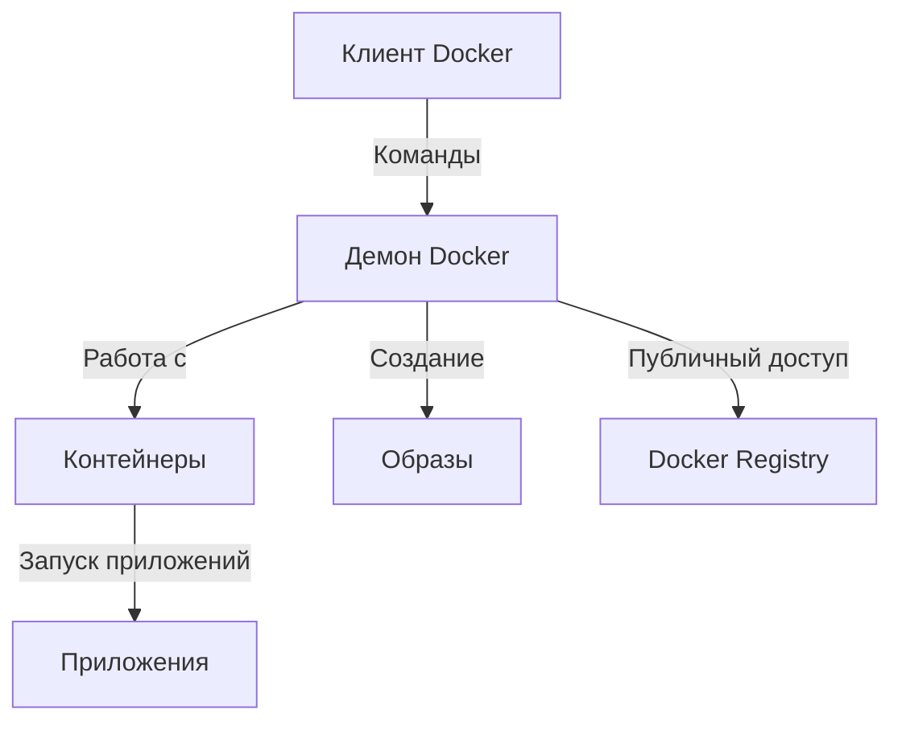

---
tags:
  - "#Docker"
---
---
# Темы

- [[Docker]]
	- [[Container]]
	- [[Image]]
	- [[Репозиторий в Docker]]
	- [[Основные команды Docker]]

---

Docker — это платформа для автоматизации развертывания, масштабирования и управления приложениями с использованием контейнеров. Она состоит из нескольких ключевых компонентов, которые взаимодействуют друг с другом для обеспечения эффективного функционирования.

![[Pasted image 20250317221502.png]]

## Основные Компоненты Docker

### 1. Docker Client (Клиент)

- **Описание**: Это основной интерфейс, с которым пользователи взаимодействуют с Docker. Клиент позволяет отправлять команды Docker через командную строку или API.
- **Функции**:
  - Выполнение команд для создания, развертывания и управления контейнерами.
  - Обработка команд и передача их демону Docker для выполнения.

### 2. Docker Daemon (Демон)

- **Описание**: Это серверная часть Docker, которая отвечает за управление контейнерами, образами и сетями.
- **Функции**:
  - Обрабатывает команды, полученные от клиента.
  - Управляет жизненным циклом контейнеров и образов.
  - Обеспечивает взаимодействие с различными хранилищами изображений.

### 3. Docker Host (Хост)

- **Описание**: Это машина, на которой работает демон Docker и размещаются контейнеры.
- **Функции**:
  - Может быть физическим или виртуальным сервером.
  - Содержит все необходимые ресурсы для развертывания и запуска контейнеров.

### 4. Docker Images (Образы)

- **Описание**: Это шаблоны контейнеров, которые содержат все необходимые файлы для запуска приложения, включая код, библиотеки и зависимости.
- **Функции**:
  - Используются для создания контейнеров.
  - Образ является статичным, но контейнеры, созданные из него, могут быть изменяющимися.

### 5. Docker Containers (Контейнеры)

- **Описание**: Это исполняемые экземпляры образов, которые работают в изолированной среде.
- **Функции**:
  - Изолируют приложение от основной операционной системы и других контейнеров.
  - Обеспечивают общую среду для выполнения приложений.

### 6. Docker Registry (Регистр)

- **Описание**: Это хранилище для хранения и распределения Docker-образов.
- **Функции**:
  - Позволяет хранить образы, загружать их и делиться ими с другими.
  - Примером является Docker Hub.

## Взаимодействие Компонентов



## Заключение

Docker предоставляет мощные инструменты для управления приложениями и их зависимостями с помощью контейнеризации. Понимание его компонентов — клиент, демон, хост, образы, контейнеры и регистрация — помогает более эффективно разрабатывать, тестировать и развертывать приложения.
### Принципы работы Docker

- **Изоляция**: Контейнеры изолированы друг от друга и от хост-системы, что позволяет запускать несколько приложений независимо.
- **Портативность**: Контейнеры могут быть развернуты в любом месте, где установлен Docker, обеспечивая совместимость между различными средами.
- **Управляемость**: Docker предлагает инструменты для управления жизненным циклом контейнеров, включая их создание, запуск, остановку и удаление.

### Основные команды Docker

1. **Установка Docker**:
   - Установите Docker на своей системе, следуя [официальной документации](https://docs.docker.com/get-docker/).

2. **Основные команды**:
   - **Справка**: 
     ```bash
     docker --help
     ```
   - **Просмотр доступных образов**:
     ```bash
     docker images
     ```
   - **Запуск контейнера**:
     ```bash
     docker run -d --name my_container my_image
     ```
   - **Остановка контейнера**:
     ```bash
     docker stop my_container
     ```
   - **Удаление контейнера**:
     ```bash
     docker rm my_container
     ```
   - **Создание образа из Dockerfile**:
     ```bash
     docker build -t my_image .
     ```
   - **Загрузка образа в Docker Hub**:
     ```bash
     docker push my_image
     ```

### Пример использования Docker

Вот пример Dockerfile для простого веб-приложения на Node.js:

```dockerfile
# Указываем базовый образ
FROM node:14

# Устанавливаем рабочую директорию
WORKDIR /app

# Копируем package.json и package-lock.json
COPY package*.json ./

# Устанавливаем зависимости
RUN npm install

# Копируем все файлы приложения
COPY . .

# Указываем порт, который будет открыт в контейнере
EXPOSE 3000

# Команда для запуска приложения
CMD ["npm", "start"]
```

### Работа с Docker Compose

Docker Compose — это инструмент для определения и управления многоконтейнерными Docker-приложениями. С помощью простого YAML-файла вы можете определить сервисы, сети и тома вашего приложения.

**Пример docker-compose.yml**:

```yaml
version: '3'
services:
  web:
    build: .
    ports:
      - "3000:3000"
  db:
    image: postgres
    environment:
      POSTGRES_USER: example
      POSTGRES_PASSWORD: example
```

### Заключение

Docker — мощный инструмент для разработчиков, позволяющий легко создавать, развертывать и масштабировать приложения. Он обеспечивает управляемость и переносимость, что делает процессы разработки и развертывания более эффективными. Если вы хотите углубиться в конкретные аспекты или у вас есть дополнительные вопросы, сообщите мне!

- [[Container]]
- [[Image]]