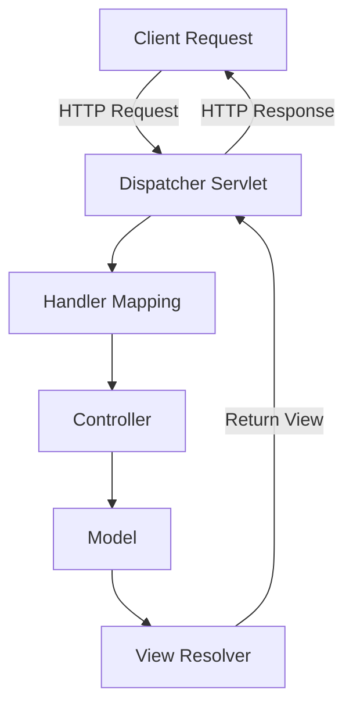

---
tags:
  - Spring
  - WEB
---

> [!info]
> **Spring MVC** (Model-View-Controller) — это мощный фреймворк для разработки веб-приложений на Java, который предоставляет основу для построения веб-приложений с использованием архитектурного паттерна MVC. Spring MVC является частью более широкого экосистемы Spring и поддерживает как RESTful, так и традиционные вэб-приложения.

### Основные компоненты Spring MVC

1. **Модель ([[Model]])**:
   - Представляет данные приложения и бизнес-логику. Модель включает сущности, которые могут быть получены из базы данных.

1. **Представление ([[View]])**:
   - Отвечает за отображение данных пользователю. В Spring MVC это может быть JSP (JavaServer Pages), Thymeleaf, Freemarker и другие.

1. **Контроллер ([[Controller]])**:
   - Обрабатывает входящие запросы, взаимодействует с моделью и определяет, какое представление следует вернуть. Контроллер содержит методы, которые соответствуют URL-запросам.

### Архитектура Spring MVC

Вот как выглядит архитектура Spring MVC:



### Основные аннотации в Spring MVC

- **@[[Controller]]**:
   - Указывает, что класс является контроллером.

- **@[[RequestMapping]]**:
   - Определяет URL-адрес, к которому будет привязан метод контроллера.

- **@GetMapping, @PostMapping**:
   - Специфичные аннотации для обработки GET и POST запросов соответственно.

- **@[[PathVariable]]**:
   - Извлекает значения из URI.

- **@[[RequestParam]]**:
   - Извлекает параметры запроса из URL.

- **@[[ModelAttribute]]**:
   - Связывает данные формы с моделью.

### Пример простого приложения Spring MVC

#### 1. Настройка проекта

Для того чтобы создать проект Spring MVC, вы можете использовать Maven или Gradle для управления зависимостями. Пример зависимостей для Maven:

```xml
<dependencies>
    <dependency>
        <groupId>org.springframework</groupId>
        <artifactId>spring-webmvc</artifactId>
        <version>5.3.12</version>
    </dependency>
    <dependency>
        <groupId>javax.servlet</groupId>
        <artifactId>javax.servlet-api</artifactId>
        <version>4.0.1</version>
        <scope>provided</scope>
    </dependency>
    <!-- Другие зависимости -->
</dependencies>
```

#### 2. Конфигурация Spring MVC

Создайте файл конфигурации `dispatcher-servlet.xml`:

```xml
<beans xmlns="http://www.springframework.org/schema/beans"
       xmlns:xsi="http://www.w3.org/2001/XMLSchema-instance"
       xmlns:context="http://www.springframework.org/schema/context"
       xsi:schemaLocation="http://www.springframework.org/schema/beans
                           http://www.springframework.org/schema/beans/spring-beans.xsd
                           http://www.springframework.org/schema/context
                           http://www.springframework.org/schema/context/spring-context.xsd">

    <context:component-scan base-package="com.example.controller" />

    <bean class="org.springframework.web.servlet.view.InternalResourceViewResolver">
        <property name="prefix" value="/WEB-INF/views/" />
        <property name="suffix" value=".jsp" />
    </bean>
</beans>
```

#### 3. Создание контроллера

Создайте контроллер в пакете `com.example.controller`:

```java
package com.example.controller;

import org.springframework.stereotype.Controller;
import org.springframework.web.bind.annotation.GetMapping;
import org.springframework.web.bind.annotation.RequestParam;
import org.springframework.ui.Model;

@Controller
public class HelloController {

    @GetMapping("/hello")
    public String hello(@RequestParam(name="name", required=false, defaultValue="World") String name, Model model) {
        model.addAttribute("name", name);
        return "hello"; // имя представления
    }
}
```

#### 4. Создание представления

Создайте JSP-файл `hello.jsp` в папке `WEB-INF/views`:

```jsp
<%@ taglib uri="http://java.sun.com/jsp/jstl/core" prefix="c" %>
<!DOCTYPE html>
<html>
<head>
    <title>Hello</title>
</head>
<body>
    <h1>Hello, ${name}!</h1>
</body>
</html>
```

#### 5. Настройка web.xml

Настройте ваше приложение в `web.xml`:

```xml
<web-app xmlns="http://xmlns.jcp.org/xml/ns/javaee"
         xmlns:xsi="http://www.w3.org/2001/XMLSchema-instance"
         xsi:schemaLocation="http://xmlns.jcp.org/xml/ns/javaee
                             http://xmlns.jcp.org/xml/ns/javaee/web-app_3_1.xsd"
         version="3.1">

    <servlet>
        <servlet-name>dispatcher</servlet-name>
        <servlet-class>org.springframework.web.servlet.DispatcherServlet</servlet-class>
        <load-on-startup>1</load-on-startup>
    </servlet>
    <servlet-mapping>
        <servlet-name>dispatcher</servlet-name>
        <url-pattern>/</url-pattern>
    </servlet-mapping>
</web-app>
```

### Запуск приложения

После подготовки всех компонентов вы можете запустить ваше приложение на сервере, таком как Apache Tomcat. Убедитесь, что все зависимости правильно настроены, и ваша структура проекта соответствует требованиям.


- [[Формы MVC]]
- [[Валидация данных]]
- [[Конфигурация приложения MVC + Hibernate]]
- [[Аннотация RestController]]

### Заключение

Spring MVC — это мощный фреймворк для разработки веб-приложений, который помогает организовать код в соответствии с архитектурой MVC. Он обеспечивает гибкость, масштабируемость и простоту тестирования благодаря своей поддержке аннотаций и интеграции с другими компонентами Spring. Используя Spring MVC, разработчики могут быстро и эффективно создавать современные веб-приложения.