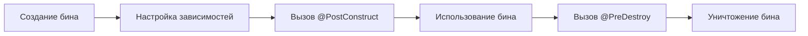

---
tags:
  - Spring
---
Жизненный цикл бина описывает последовательность шагов, которые проходят объекты (бины) от их создания до уничтожения. Этот процесс включает несколько важных стадий:

### 1. Создание бина
- **Инициализация**: Контейнер создает экземпляр бина.
- **Настройка зависимостей**: Связанные бины инжектируются в создаваемый бин.

### 2. Настройка
- **Метод `@PostConstruct`**: После того, как бины созданы и зависимости инжектированы, может быть вызван метод, помеченный аннотацией `@PostConstruct`. Это место, где можно выполнять любые дополнительные настройки.

### 3. Использование
- **Употребление бина**: Бин становится доступным для использования в приложении.

### 4. Уничтожение
- **Метод `@PreDestroy`**: Перед уничтожением бина может быть вызван метод, помеченный аннотацией `@PreDestroy`, что дает возможность выполнить завершающие действия.
- **Освобождение ресурсов**: Контейнер освобождает ресурсы, связанные с биным, и удаляет его из памяти.

### Схема жизненного цикла бина



### Пример кода

Вот простой пример, демонстрирующий использование аннотаций `@PostConstruct` и `@PreDestroy`:

```java
import javax.annotation.PostConstruct;
import javax.annotation.PreDestroy;
import org.springframework.stereotype.Component;

@Component
public class MyBean {

    @PostConstruct
    public void init() {
        System.out.println("Бин инициализирован!");
    }

    public void use() {
        System.out.println("Использование бина...");
    }

    @PreDestroy
    public void destroy() {
        System.out.println("Бин удаляется!");
    }
}
```

### Заключение

Жизненный цикл бина в Java — это важный аспект, который позволяет эффективно управлять ресурсами и зависимостями в приложении. Понимание этапов жизненного цикла поможет лучше организовать работу с вашими Java-приложениями.